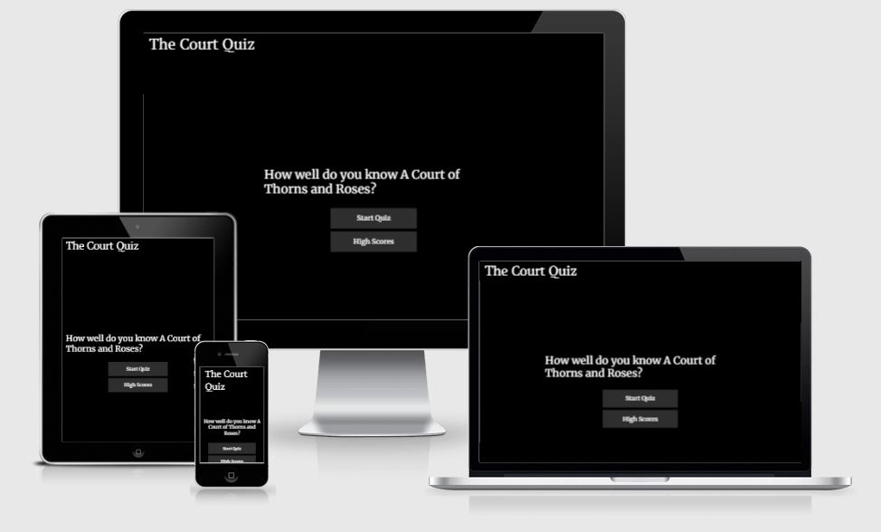
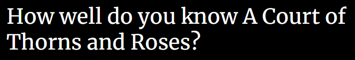
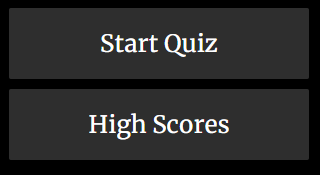
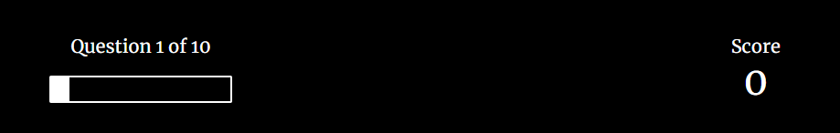
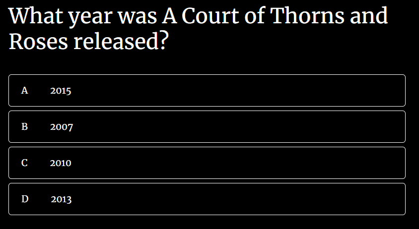
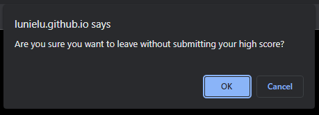

# **The Court Quiz** - A Milestone Project 

## __Introduction__
---

Hello & Welcome to my second Code Institute Milestone Project:
A Quiz website based around the book _"A Court of Thorns and Roses"_ by Sarah J Maas; one of my all time favourite book series.

During my time learning JavaScript with Code Institute, I admit I have found it very challenging and a problem that seems to be just slightly out of reach.

This project will hopefully show a basic understanding of the knowledge I managed to gather during the weeks studying on my Full Stack Software Development Diploma with Code Institute; but it will also give an insight into the struggles I encountered during this time, with myself to be the first to admit that JavaScript is still a programming language that I do not feel confident writing in during the time of creating this project and ReadME.

However, that doesn't mean that I have given up - Merely that this is a stepping stone towards more hours spent tackling JavaScript projects from different angles and with the help of additional resources.

I will go into more detail below about the site and I thank you for taking the time to view this project.

[Link to the Live Project](https://lunielu.github.io/TheCourtQuiz/)



## __Features__
---

### ___Index Page___
The Homepage. 
The user will see this page when arriving to the site for the first time and on return visits to the site. It includes the Logo/Title of the Quiz "The Court Quiz", an Introductory Question and two Buttons; 'Start Quiz' & 'High Scores'.
The 'Start Quiz' button will launch the quiz for the user, the 'High Scores' button will divert the user to the highscores.html page, where the Leaderboard can be found.
- Logo


- Introduction



- Buttons
    - Start Quiz
    - High Scores



### ___Quiz Page___
The main function for the site. The Quiz includes 10 questions, which are randomized for the user and each have 4 answers to choose from, with only 1 correct and 3 incorrect. The user's progress is tracked by a small white bar in the 'HUD' area of the screen, with a statement "Question x of 10" giving the user an indication how many questions they have completed/yet to complete. 
There is also a score counter within the 'HUD', with users receiving 100 points for each correct answer and 0 points for an incorrect answer. 
When a user selects a correct answer, the container will turn 'gold'. If it is incorrect, the container will turn red.
- HUD (Heads-up Display)
    - Progress Bar
    - Score



- Questions



### ___End Page___
The final page that the user is automatically redirected to once they have completed the quiz. This page includes a section that shows the user their final score from the amount of correct answers they had, with an input box to allow them to enter their name, with 3 buttons below: 'Save', 'Play Again' and 'Go Home'. 
The 'Save' button is disabled until a user inputs their name, which then enables the functionality to save the score (Later shown on the Leaderboard) and will redirect the user back to the Index/Homepage. 
The Play Again button will restart the quiz once more, refreshing the user's points back to 0. The 'Go Home' button, when clicked, will provide an alert box asking the user 'Are you sure you want to leave without submitting your high score?"; if the user clicks 'OK', they will be redirected to the Index/Homepage. 
If the user clicks 'Cancel', they will remain on the current page.
    
- Final Score
    - Name Input/Save Function

    

- Buttons
    - Play Again
    - Go Home
        - Alert Box  

    

### ___High Scores Page___
The high scores page can be accessed through the Index/Homepage, by clicking the 'High Scores' button.
This page shows a leaderboard of names & scores from previous plays of the quiz. This data is saved to local storage and will not be shared amongst different devices.
The 'Go Home' button returns the user to the Index/Homepage.

- Leaderboard
    - Name
    - Score
- Go Home Button

## __Testing__
---

### ___Validator Testing___

- This site has been tested on the following validators:
    - HTML:
        - No known errors were returned when passed through the official [W3C Validator](https://validator.w3.org/#validate_by_input)
    - CSS:
        - No known errors were returned when passed through the official [Jigsaw W3C CSS Validator](https://jigsaw.w3.org/css-validator/#validate_by_input)
    - Javascript:
        - 2 Errors were returned when passed through the official [JSHint Validator](https://jshint.com/)
            - Two unused variables
            - ```14	saveHighScore```
            - ```34	homeBtn```
                - This is due to these variables being pulled from the 'OnClick' functionality in the end.html file.
        - The following metrics were returned on the below files:
            - highscores.js
                - There is only one function in this file.
                - It takes one argument.
                - This function contains only one statement.
                - Cyclomatic complexity number for this function is 1.
            - quiz.js
                - There are 7 functions in this file.
                - Function with the largest signature take 1 arguments, while the median is 1.
                - Largest function has 12 statements in it, while the median is 2.
                - The most complex function has a cyclomatic complexity value of 4 while the median is 1.
            - end.js
                - There are 4 functions in this file.
                - Function with the largest signature take 2 arguments, while the median is 0.5.
                - Largest function has 7 statements in it, while the median is 2.5.
                - The most complex function has a cyclomatic complexity value of 2 while the median is 1.

### ___Known Bugs & Fixes___

- Scores not saving and returning a 'Null' value
    - I encountered an issue pretty early on in the project, where the scores would not save a integer, but was returning a 'null' value.
    - During testing and bug-fixing, I found that the file path syntax was incorrect on the end.js page for the 'highscores' section.
        - Instead of putting '/', I had input '..' instead on the windows.location.assign value.
        - Adjusting '..' and replacing it with '/' rectified the issue, with scores now saving to a local cache and showing on the 'highscores.html' page.
    - Tested again on 16/04 as a final 'testing' phase before submission, found that the 'save' functionality was returning a 404 error.
        - This was due to the windows.location function going to href instead of assign.
        - I updated this, pushed to the live site and once again tested the functionality and found the issue had been corrected; and that scores were now being saved and values returned on the 'Highscore' page.


- Issues with "Go Home" button alert not directing user back to index.html when clicking "OK"
    - Once a user has completed the quiz, they are redirected to the end.html page; with the option to save their highscore.
    - I added an alert to pop-up if a user tries clicking 'Go Home' without saving their score.
    - During the testing phase, I found that the redirect was not taking a user back to the index.html page for "The Court Quiz" repo; instead it was just redirecting to a random "index.html" page that returned a 404 Error.
    - I managed to fix this by adjusting the syntax from windows.location.assign to windows.location.href and changing the file path from local files, to the url for the index.html page (https://lunielu.github.io/TheCourtQuiz/index.html).
    - This fixed the problem and users now direct back to the correct index.html page when they click OK on the pop-up from the 'Go Home' button on the end.html page.


## __Deployment__
---

___Deploying a GitHub Repository on GitHub Pages___

- The site has been deployed to GitHub pages. The steps to deploy are as follows:
    - In the GitHub repository menu for [The Court Quiz](https://github.com/LunieLu/TheCourtQuiz), please navigate to the Settings tab.
    - Under the heading 'Code and Automation', click on Pages.
    - From the source section drop-down menu, select the Main branch.
    - Press the 'Save' button and the site will provide a link to the completed website.

Please view the GitHub pages live link for **The Court Quiz** [here.](https://lunielu.github.io/TheCourtQuiz/index.html)

___Making a Local Clone___
- Find the GitHub Repository [The Court Quiz](https://github.com/LunieLu/TheCourtQuiz).
- Click the Code button.
- Copy the URL found under HTTPS.
- In Gitpod, change the directory to a location that you would like the cloned repo to be located.
- In the console, type 'git clone' and then paste the URL you copied.
- Press Enter and this will create the local clone.

## __Credits__
---

- Basic HTML, CSS & JavaScript Quiz Structure heavily influenced by [YouTube Tutorial by Brian Design](https://youtu.be/f4fB9Xg2JEY)
- Resources & Tutorials to create JavaScript alerts from [w3schools](https://www.w3schools.com/)

## __Acknowledgements__
---

 - The below people/groups helped support and advise over the last few weeks whilst creating this project; offering Slack sessions to discuss ideas, problem solve and review JavaScript basics, as well as provide guidance during hard times where the code didn't work how I assumed it would:
    - Harry Dhillion (Fellow Full Stack Software Development Code Institute Student)
    - Mike Avgeros (Fellow Full Stack Software Development Code Institute Student)
    - #london-community Slack Channel


## A Final Note
---

I want to say a huge thank you to anyone reviewing this code and who have taken the time to play my little quiz.
This project was something of a massive roadblock for me, and tested not only my problem-solving skills, but also my patience and drive to be a software developer. Whilst I'm not completely happy with this project, I am proud that I managed to get through it and submit a fully working site based on one of my all time favourite book series. I know from my experience over the past few weeks, that JavaScript is a challenging and exciting programming language, that I am eager to learn more of and slowly increase my confidence over time.

__Here's to a submitted JavaScript project, with the promise to continue striving to improve and aim high; and to not let my perfectionism or imposter syndrome get the better of me!__